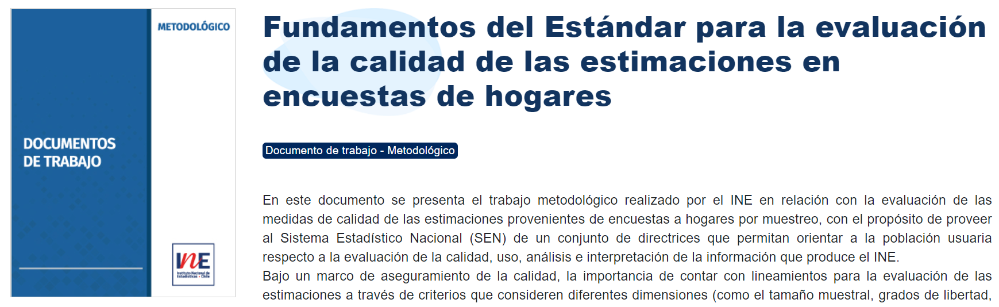
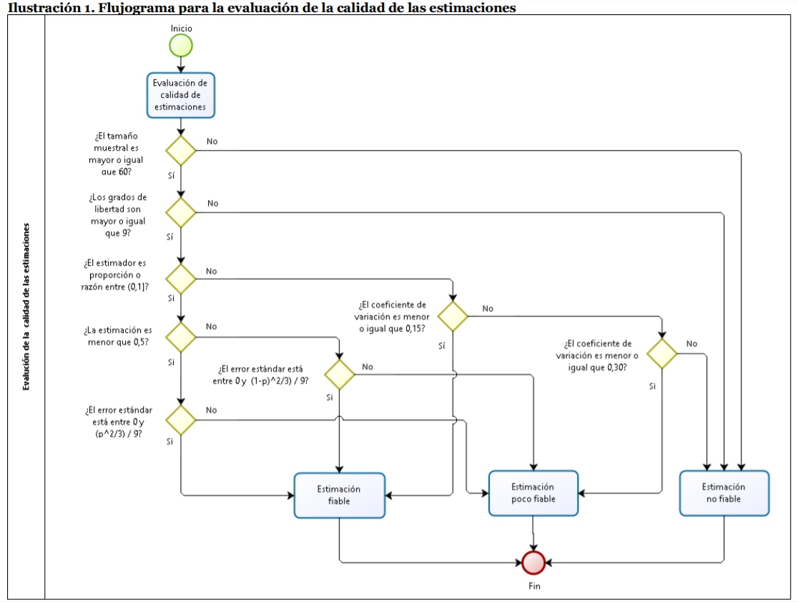
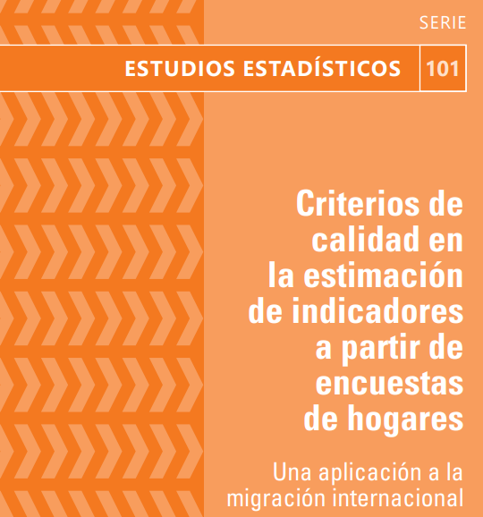
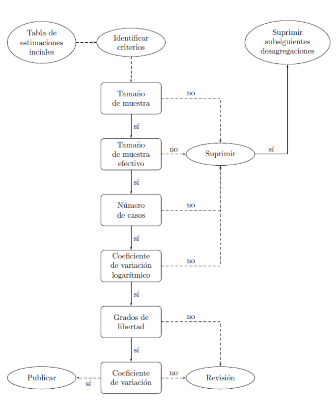
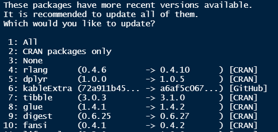

class: center, middle

.linea-superior[]
.linea-inferior[]


## Capacitación en uso paquete calidad

## Proyecto Estratégico Servicios Compartidos para la Producción Estadística

### Julio 2022

```{r setup, include=FALSE}
options(htmltools.dir.version = TRUE)
knitr::opts_chunk$set(message = FALSE, warning = F) 
options(scipen = "999")
```

```{r xaringan-themer, include=FALSE, warning=FALSE}
library(xaringanthemer)
```

---

background-image: url("imagenes/fondo2.PNG")
background-size: contain;
background-position: 100% 0%

# Estructura del taller


- Mirada general de estándares INE Chile y CEPAL

--

- Estimaciones con el paquete `calidad`

--

- Evaluación de estimaciones con el paquete calidad 


--

**Objetivo del taller**

- Capacitar a los asistentes en el uso del paquete calidad para la aplicación de estándares en encuestas de hogares

--

### Asumiremos un conocimiento básico de R

---


class: inverse, center, middle

# I. Mirada general a los estándares


---

background-image: url("imagenes/fondo2.PNG")
background-size: contain;
background-position: 100% 0%

# Estándar de calidad INE Chile

Desde 2020, INE Chile cuenta con un [estándar](https://www.ine.cl/docs/default-source/documentos-de-trabajo/20200318-lineamientos-medidas-de-precisi%C3%B3n.pdf?sfvrsn=f1ab2dbe_4) para evaluar la calidad de estimaciones provenientes de encuestas de hogares


.center[

]

--

Nos permite determinar si una estimación es **fiable, poco fiable o no fiable** 

--

Nos orienta respecto a si un tabulado debe ser publicado o no


---
background-image: url("imagenes/fondo2.PNG")
background-size: contain;
background-position: 100% 0%

# Estándar de calidad INE Chile

Existe un flujo, que nos permite etiquetar **automáticamente** cada estimación 

--

.center[

]

---

background-image: url("imagenes/fondo2.PNG")
background-size: contain;
background-position: 100% 0%

# Estándar de calidad INE Chile

## El flujo establece caminos diferenciados

--

### Estimaciones de proporción (o razón) entre **0 y 1**

- Tamaño muestral
- Grados de libertad
- .red[Error estándar] 

--

### Resto de estimaciones

- Tamaño muestral
- Grados de libertad
- .red[Coeficiente de variación] 
 

### En un caso usamos el SE y en otro el CV

---
background-image: url("imagenes/fondo2.PNG")
background-size: contain;
background-position: 100% 0%

# Aspectos generales del estándar CEPAL

.center[

]


---


background-image: url("imagenes/fondo2.PNG")
background-size: contain;
background-position: 100% 0%

# Estándar de calidad CEPAL


.center[

]


---

background-image: url("imagenes/fondo2.PNG")
background-size: contain;
background-position: 100% 0%

# Estándar de calidad CEPAL

* **El estándar CEPAL considera:**
  + .small[coeficiente de variación]
  + .red[.small[coeficiente de variación logarítmico]] 
  + .small[tamaño de muestra]
  + .red[.small[tamaño de muestra efectivo]] 
  + .red[.small[conteo de casos no ponderado]]
  + .small[grados de libertad] 


---

background-image: url("imagenes/fondo2.PNG")
background-size: contain;
background-position: 100% 0%

# Introducción paquete calidad

### ¿Cómo pasar del documento a la práctica?

.center[

]

--

Existen múltiples herramientas (Stata, R, SAS, Python) y todas son válidas

--

Múltiples modalidades dentro de cada herramienta (libertad total, scripts estandarizados, funciones, etc)

--

Es útil contar con una herramienta que **estandarice** los criterios de calidad


---

background-image: url("imagenes/fondo2.PNG")
background-size: contain;
background-position: 100% 0%

# Introducción paquete calidad

Una posibilidad es el uso de un **paquete (librería)**

--

El paquete `calidad` implementa el estándar mediante `R`

--

### Objetivos del paquete

- Facilitar la aplicación del estándar a usuarios externos
- Aumentar la eficiencia en el trabajo de los analistas
- Reducir la probabilidad de error en la implementación

--

El paquete `calidad` combina el estándar del INE con el paquete `survey`, desarrollado por Thomas Lumley


.center[

]

--

.center[
### Revisaremos velozmente el paquete survey
]


---

background-image: url("imagenes/fondo2.PNG")
background-size: contain;
background-position: 100% 0%

# Brevísima revisión de survey

Usaremos los datos del trimestre NDE-2020 de la ENE


```{r}
library(readr)
library(tidyverse)
ene <- read_delim("data/ene-2020-12-nde.csv", delim = ";")

```

--

Construyamos algunas variables necesarias para calcular indicadores relevantes del mercado laboral

```{r}
ene <- ene %>% 
  mutate(fdt = if_else(cae_especifico >= 1 & cae_especifico <= 9, 1, 0), # fuerza de trabajo
         ocupado = if_else(cae_especifico >= 1 & cae_especifico <= 7, 1, 0), # persona ocupada
         desocupado = if_else(cae_especifico >= 8 & cae_especifico <= 9, 1, 0), # persona desocupada
         metro = if_else(region == 13, 1, 0)) 


```

```{r, include=F, echo=F}

keys <- ene %>% 
  group_by(conglomerado) %>% 
  slice(1) %>% 
  ungroup() %>% 
  mutate(conglomerado2 = row_number()) %>% 
  select(conglomerado2, conglomerado)

ene <- ene %>% 
  left_join(keys, by = "conglomerado") %>% 
  select(-conglomerado) %>% 
  rename(conglomerado = conglomerado2)

```


---
background-image: url("imagenes/fondo2.PNG")
background-size: contain;
background-position: 100% 0%

# Brevísima revisión de survey

En primer lugar, declaramos el diseño complejo con la función `svydesign`
```{r}
library(survey)
dc <- svydesign(weights = ~fact_cal, ids = ~conglomerado, strata = ~estrato,
                  data = ene )
```

Debemos declarar:
- UPM 
- Estratos
- Pesos de muestreo (factor de expansión)

--

Es importante indicarle a `survey` qué hacer cuando existen estratos que solo tienen una UPM 

```{r}
options(survey.lonely.psu = "certainty")
```


---
background-image: url("imagenes/fondo2.PNG")
background-size: contain;
background-position: 100% 0%

# Brevísima revisión de survey

### Ahora podemos usar los paquetes `survey` y  `calidad` 😃😃😃😃😃

--

**Calculemos la tasa de desempleo**

```{r}
svymean(x = ~desocupado, subset(dc, fdt == 1))

```
--

**También podríamos calcularla así**

```{r}
svyby(formula = ~desocupado, design = dc, by = ~fdt, FUN = svymean)
```
--

**O así...**

```{r, eval=F}
svyratio(numerator = ~desocupado, denominator = ~fdt, subset(dc, fdt == 1))
```


---
background-image: url("imagenes/fondo2.PNG")
background-size: contain;
background-position: 100% 0%

# Brevísima revisión de survey

`survey` permite hacer una infinidad de cálculos 

- `svymean`
- `svytotal`
- `svyratio`
- `svyby`
- `svyquantile`

--

Mediante la función `as.svrepdesign` podemos, además, utilizar métodos de remuestreo

- intervalos de confianza de percentiles
- cv de percentiles

--

.center[
### El paquete survey es una gran herramienta que nos hace la vida más fácil 
]

.center[

]


---
background-image: url("imagenes/fondo2.PNG")
background-size: contain;
background-position: 100% 0%

# Instalación paquete calidad

Lo primero, es descargar el paquete desde `github`

Se requiere el paquete `devtools`

```{r, eval=F}
library(devtools)
install_github("inesscc/calidad")
```

--

### En la consola, aparecerá el siguiente mensaje


.center[

]

### Debes escribir 3 en la consola y luego enter

---
background-image: url("imagenes/fondo2.PNG")
background-size: contain;
background-position: 100% 0%

# Panorama general

Lo siguiente, es cargar el paquete en la sesión

```{r}
library(calidad)
```

El paquete `calidad` tiene 2 grandes familias de funciones:

- *create_*: permiten **crear** los insumos para el estándar
- *evaluate_*: permiten hacer la **evaluación** del estándar

--

Podemos hacer los siguientes cálculos

- `create_mean`: calcular la media 
- `create_prop`: proporción o razón 
- `create_tot` / `create_size`: conteo de unidades 
- `create_tot_con` / `create_total` : suma de variables continuas 
- `create_median`: mediana 


--

### Estas funciones devuelven la estimación y los insumos para el estándar


---

class: inverse, center, middle

# II. Creación de los insumos


---
background-image: url("imagenes/fondo2.PNG")
background-size: contain;
background-position: 100% 0%

# Creando los insumos: create_mean

Queremos calcular la edad media para mujeres y hombres

--

```{r}
create_mean(var = edad, dominios = sexo, disenio = dc)
```

- `var`: variable a estimar
- `dominios`: desagregaciones
- `disenio`: diseño muestral creado con `svydesign`

--

La función genera:
- estimación 
- error estándar (se)
- grados de libertad (gl)
- tamaño muestral (n)


---
background-image: url("imagenes/fondo2.PNG")
background-size: contain;
background-position: 100% 0%

# Creando los insumos: create_mean

A diferencia de `survey`, en el paquete `calidad` no es necesario utilizar ~  

```{r, eval=F}
# Argumentos con paquete survey
svyby(formula = ~edad, by = ~sexo, design =  dc, FUN = svymean) 
```


--

Tampoco se requiere que los argumentos estén escritos como *strings*

--

Sin embargo, existe la libertad para usar *strings*

```{r}
# Argumentos con paquete calidad
create_mean(var = "edad", dominios = sexo,  disenio = dc)

```


---
background-image: url("imagenes/fondo2.PNG")
background-size: contain;
background-position: 100% 0%

# Creando los insumos: create_prop

Volvamos al caso de la tasa de desempleo

--

Para ello, contamos con la función `create_prop`

--

Podríamos hacer algo similar a lo anterior


```{r, eval=F}
create_prop(var = desocupado, dominios = sexo, disenio = dc)
```

--

El problema es que el desempleo debe calcularse sobre una subpoblación específica (fuerza de trabajo)

--

Para ello, utilizamos el argumento `subpop`

```{r, eval=F}
create_prop(var = desocupado, dominios = sexo, subpop = fdt, disenio = dc)
```

--

Es muy importante considerar que la variable **subpop debe ser dummy** 


---
background-image: url("imagenes/fondo2.PNG")
background-size: contain;
background-position: 100% 0%

# Creando los insumos: create_prop

¿Qué pasa si queremos desagregar por más variables?

--

Se debe agregar otra variable utilizando un signo +

```{r}
create_prop(var = desocupado, dominios = sexo+metro, subpop = fdt, disenio = dc)

```

---
background-image: url("imagenes/fondo2.PNG")
background-size: contain;
background-position: 100% 0%

# Creando los insumos: create_prop

Queremos calcular el número de ocupad**os** respecto al número de ocupad**as**

$$  \frac{SumaOcupadosHombre}{SumaOcupadosMujer}$$
--

Lo primero que debemos hacer es crear variables auxiliares 

```{r}
ene <- ene %>% 
  mutate(ocupado_hombre = if_else(sexo == 1, ocupado, 0),
         ocupado_mujer  = if_else(sexo == 2, ocupado, 0))


```


Volvemos a declarar el diseño para incluir las variables recién creadas 

```{r}
dc <- svydesign(ids = ~conglomerado, strata = ~estrato, weights = ~fact_cal,  data = ene )
```


---

background-image: url("imagenes/fondo2.PNG")
background-size: contain;
background-position: 100% 0%

# Creando los insumos: create_prop

La función `create_prop` permite incluir el argumento `denominador`

```{r}
create_prop(var = ocupado_hombre, denominador = ocupado_mujer, 
            subpop = fdt, disenio = dc)

```
--

Podemos agregar el parámetro `dominios`, si queremos desagregar 


```{r}
create_prop(var = ocupado_hombre, denominador = ocupado_mujer, 
            dominios = metro , subpop = fdt, disenio = dc)

```

---

background-image: url("imagenes/fondo2.PNG")
background-size: contain;
background-position: 100% 0%

# Ejercicio ~~no tan~~ express (10 minutos)

Calculemos el número total de casados sobre el total de convivientes. Para ello, deben utilizar la variable `est_conyugal` y seguir los siguientes pasos:

- Crear variables dummy para casados (est_conyugal == 1) y para conviviente (est_conyugal == 2)
- Declarar el diseño complejo con las nuevas columnas creadas
- Utilizar la función `create_prop` 

--


```{r}
ene <- ene %>% 
  mutate(casado = if_else(est_conyugal == 1, 1, 0),
         conviviente  = if_else(est_conyugal == 2, 1, 0))

dc <- svydesign(ids = ~conglomerado, strata = ~estrato, weights = ~fact_cal,  data = ene )
create_prop(var = casado, denominador = conviviente,  disenio = dc )

```


---
background-image: url("imagenes/fondo2.PNG")
background-size: contain;
background-position: 100% 0%

# Creando los insumos: create_tot

Si queremos un conteo de casos, podemos usar `create_tot`

--

Por ejemplo, número de ocupados por región

--

```{r}
create_tot(var = desocupado, dominios = sexo, subpop = fdt, disenio = dc)

```

--

.red[Se requiere que la variable a estimar sea dummy]

```{r, error=T, eval=T}
create_tot(var = est_conyugal, dominios = sexo, subpop = fdt, disenio = dc)

```


---
background-image: url("imagenes/fondo2.PNG")
background-size: contain;
background-position: 100% 0%

# Argumentos adicionales

Si queremos calcular el **intervalo de confianza** para la media de edad

```{r}
create_mean(var = edad, dominios = sexo, disenio = dc, ci = T)
```

--

Si queremos retornar el **efecto diseño** podemos usar el parámetro deff 

```{r}
create_mean(var = edad, dominios = sexo, disenio = dc, ci = T, deff = T)
```

--

De manera similar podemos obtener:

- Tamaño de muestra efectivo
- Error relativo
- Conteo no ponderado


---

class: inverse, center, middle


# III. Evaluación del estándar


---
background-image: url("imagenes/fondo2.PNG")
background-size: contain;
background-position: 100% 0%

# Evaluación del estándar

Existe una función de evaluación para cada tipo de estimación

- `evaluate_mean`
- `evaluate_prop` 
- `evaluate_tot` / `evaluate_size`
- `evaluate_tot_con` / `evaluate_total`
- `evaluate_median`

--

Estas funciones reciben como argumento la tabla creada por las funciones `create_*`

---
background-image: url("imagenes/fondo2.PNG")
background-size: contain;
background-position: 100% 0%

# Evaluación del estándar

Evaluemos si la media de edad por sexo cumple con el estándar INE

--

```{r}
est <- create_mean(var = edad, dominios = sexo, disenio = dc)
evaluate_mean(est)

```

--

Tenemos 4 columnas nuevas

- `eval_n`: indica si el tamaño muestral es sufciente
- `eval_gl`: indica si los gl son suficientes
- `eval_cv`: indica el tramo en el que está el cv
- `calidad`: evaluación final de la estimación


---
background-image: url("imagenes/fondo2.PNG")
background-size: contain;
background-position: 100% 0%

# Evaluación del estándar

Veamos el caso de la tasa de desempleo 

```{r}
est <-  create_prop(var = desocupado, dominios = sexo, disenio = dc)
evaluate_prop(est)
```
--

Además de las columnas ya vistas, tenemos 

- `prop_est`
- `tipo_eval`
- `cuadratica`
- `eval_se`
- `eval_cv`


---


background-image: url("imagenes/fondo2.PNG")
background-size: contain;
background-position: 100% 0%

# Evaluación del estándar

¿Qué pasa si queremos considerar los criterios de CEPAL?

.center[

]

--

```{r}
est <- create_size(var = desocupado, dominios = region+sexo, disenio = dc, 
                   unweighted = T, deff = T, ess = T)

evaluate_size(est, scheme = "cepal") %>% 
  select(region, sexo, total, n, gl, coef_var, unweighted, ess, tag) %>% 
  slice(1:6)

```

---

background-image: url("imagenes/fondo2.PNG")
background-size: contain;
background-position: 100% 0%

# Evaluación del estándar

¿Y si necesito manejar los parámetros del estándar?

.center[

]


--

```{r}
est <- create_size(var = desocupado, dominios = region+sexo, disenio = dc,
                   unweighted = T, deff = T, ess = T)

evaluate_size(est, scheme = "cepal", unweighted = 70, ess = 180) %>% 
  select(region, sexo, total, n, gl, coef_var, unweighted, ess, tag) %>% 
  slice(1:6)

```


---

background-image: url("imagenes/fondo2.PNG")
background-size: contain;
background-position: 100% 0%

# Visualización estándar

La función `tabla_html` aún está en desarrollo, pero ya está disponible para ser usada

Recibe como argumento el output de `evaluate` 


```{r}

tabla_html(evaluate_tot(est) %>% slice(1:5)) 


```

---

background-image: url("imagenes/fondo2.PNG")
background-size: contain;
background-position: 100% 0%

# Estándar CEPAL

¿Y si necesito manejar los parámetros del estándar?

.center[

]


--

```{r}
est <- create_size(var = desocupado, dominios = region+sexo, disenio = dc,
                   unweighted = T, deff = T, ess = T)

evaluate_size(est, scheme = "cepal", unweighted = 70, ess = 180) %>% 
  select(region, sexo, total, n, gl, coef_var, unweighted, ess, tag) %>% 
  slice(1:6)

```


---
background-image: url("imagenes/fondo2.PNG")
background-size: contain;
background-position: 100% 0%

# Utilización de loops

Queremos calcular la media para varias variables

--

En este caso, queremos la media de `edad` y `curso`, según sexo

--

Podemos generar un loop, agregando el parámetro `standard_eval = T`


```{r}

insumos <- data.frame()
for (var in c("edad", "curso")) {
  insumo <- create_mean(var = var, dominios = "sexo", disenio = dc,
                        standard_eval = T )  
  insumos <- bind_rows(insumos, insumo)
}


```
--

Podemos hacer lo mismo, utilizando el paquete `purrr` (mucho más recomendado que un for)


```{r}
insumos <- map_df(c("edad", "curso"), ~create_mean(var = .x, dominios = "sexo",
                                                   disenio = dc, standard_eval = T ))

```

---

background-image: url("imagenes/fondo2.PNG")
background-size: contain;
background-position: 100% 0%

# Próximos pasos

Estamos reestructurando el paquete para simplificar su uso

--

Homologaremos las 4 funciones básicas entre INE y CEPAL  

- create_size
- create_prop
- create_total
- create_mean

--

Crearemos una única función de evaluación 

- evaluate

--

Traduciremos todo al inglés

--

Pasaremos a CRAN


---

background-image: url("imagenes/fondo2.PNG")
background-size: contain;
background-position: 100% 0%

# Desarrollo open source

El paquete `calidad` es un desarrollo completamente *open source* 

--

Estos proyectos se nutren del aporte de la comunidad

--

En este [repositorio de github](https://github.com/inesscc/calidad) pueden proponer nuevos desarrollos

--

Ricardo Pizarro y yo somos los mantenedores 

--

Pueden generar *issues* o nuevas ramas de desarrollo 

--

Si en tu región tienes un desarrollo o mejora, estaremos felices de revisarlo e incorporarlo al paquete  

.center[
### 😄😄😄😄😄
]


---
background-image: url("imagenes/fondo2.PNG")
background-size: contain;
background-position: 100% 0%

# Un poco de práctica

- Calcula el total de desocupados según tramo etario  
- Evalúa si el tabulado cumple con el estándar
- Genera una visualización de la tabla evaluada

--

```{r, eval=F}
tramo_ocup <- create_tot(desocupado, dominios = tramo_edad, subpop = fdt, disenio = dc)
eval_tramo <- evaluate_tot(tramo_ocup, publicar = T)
tabla_html(eval_tramo)

```

--
- Calcula el total de desocupados según tramo etario y sexo  
- Evalúa si el tabulado cumple con el estándar
- Genera una visualización de la tabla evaluada

```{r, eval=F}
tramo_sexo_ocup <- create_tot(desocupado, dominios = tramo_edad+sexo, subpop = fdt, disenio = dc)
eval_tramo_sexo <- evaluate_tot(tramo_sexo_ocup, publicar = T)
tabla_html(eval_tramo_sexo)

```

---

background-image: url("imagenes/fondo2.PNG")
background-size: contain;
background-position: 100% 0%

# Un poco de práctica

- Calcula el total de desocupados según tramo etario y region  
- Evalúa si el tabulado cumple con el estándar
- Genera una visualización de la tabla evaluada

```{r, eval=F}
tramo_region_ocup <- create_tot(desocupado, dominios = tramo_edad+region, subpop = fdt, disenio = dc)
eval_region_tramo <- evaluate_tot(tramo_region_ocup, publicar = T)
tabla_html(eval_region_tramo)

```


---

class: center, middle

.linea-superior[]
.linea-inferior[]


## Capacitación en uso paquete calidad

## Proyecto Estratégico Servicios Compartidos para la Producción Estadística

### Julio 2022
